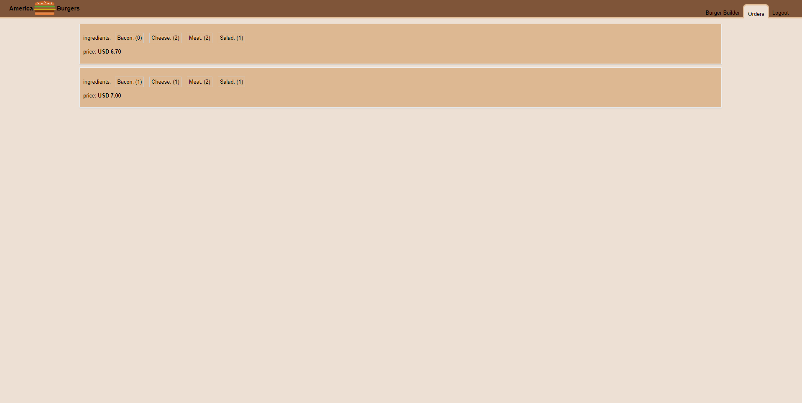

## Street Shop

> Food order platform built with React & Firebase.

## Description

App where users can order burger by choosing ingredients. You just need to simply create an account and login to order your burger.




## Technologies & Tools

- React
- react-redux
- axios
- Firebase
- CSS
- enzyme for tsets

## Features

- User authentication with Firebase.
- Forms validation
- Axios interceptors to handle errors on app-wide basis via a higher order component.
- Routing within single page application with react-router
- State management with Redux
- Lazy loading higher order component
- Saves orders to Firbase database.

## Usage

### Env Variables

Create a .env file in the root and add the following

```
REACT_APP_FIREBASE_API = your Firebase api key
```

### Install Dependencies

```
npm install
```

### Run

```
# Run on port :3000
npm start
```
